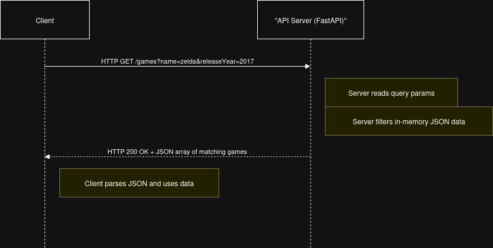

# microservice_a
# Game Search Microservice

This microservice provides a REST API to search and filter a database of video games stored in JSON format.

---

## Communication Contract

### Base URL

http://127.0.0.1:8000


### Endpoint

`GET /games`

---

### Requesting Data

You can request data by sending an HTTP GET request to the `/games` endpoint with **optional** query parameters to filter the results.

**Query Parameters:**

| Parameter    | Type    | Description                                    | Example           |
|--------------|---------|------------------------------------------------|-------------------|
| `name`       | string  | Filter by substring match in the game's name (case-insensitive) | `name=zelda`      |
| `releaseYear`| integer | Filter by exact release year                   | `releaseYear=2017`|
| `genre`      | string  | Filter by exact genre (case-insensitive)      | `genre=Adventure` |

**Example Request:**

```http
GET /games?name=zelda&releaseYear=2017 HTTP/1.1
Host: 127.0.0.1:8000
```
Or using curl:

`curl "http://127.0.0.1:8000/games?name=zelda&releaseYear=2017"`

**Receiving Data**

The microservice responds with a JSON array containing game objects that match the filters.

**Response Format:**

```[
  {
    "name": "The Legend of Zelda: Breath of the Wild",
    "releaseYear": 2017,
    "genre": "Adventure"
  },
  ...
]
```

If no games match, the response will be an empty array `[]`.

HTTP status code will be 200 OK on success.

**UML Sequence Diagram**

Below is a simplified UML sequence diagram describing the interaction between the Client (your code) and the Game Search Microservice:




**Step-by-step:**

- Client sends an HTTP GET request to /games with optional query parameters (name, releaseYear, genre).

- API Server parses the query parameters.

- The server filters the loaded JSON game database according to the query.

- The server returns a JSON array of matching game objects with HTTP 200 status.

- Client receives the JSON response and processes it as needed.

**Notes**

- This API uses case-insensitive substring matching for name.

- The releaseYear filter matches exact integer values.

- The genre filter matches exact strings but case-insensitive.

- The API supports any combination of filters or none (returns all games).

- The server must be running and accessible at http://127.0.0.1:8000.